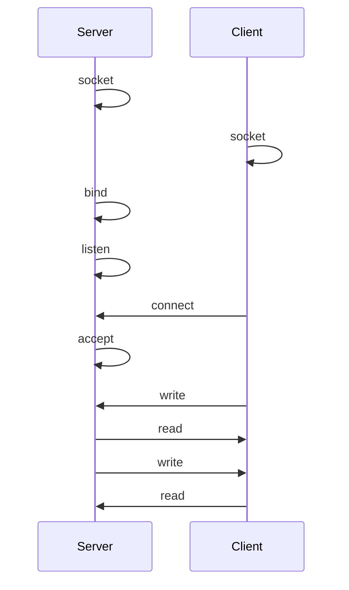

<!-- ----------------------------------------------------------------------- -->
<!-- Copyright (c) YanJibin <qivmvip AT gmail DOT net> All rights reserved.  -->
<!-- Licensed under the MIT license,  see LICENSE file in the project root.  -->
<!-- ----------------------------------------------------------------------  -->
<!-- + author : YanJibin <qivmvip AT gmail DOT net>                          -->
<!-- + date   : 2022-05-01                                                   -->
<!-- + desc   : log utilities header                                         -->
<!-- ----------------------------------------------------------------------- -->

# echo_c_unix

## Flow



## Keypoints

### 1. Multipass Ubuntu

```bash
Starting primary  Welcome to Ubuntu 20.04.3 LTS (GNU/Linux 5.4.0-97-generic x86_64)

 * Documentation:  https://help.ubuntu.com
 * Management:     https://landscape.canonical.com
 * Support:        https://ubuntu.com/advantage

  System information as of Thu May  5 01:18:25 CST 2022

  System load:              0.47
  Usage of /:               83.2% of 4.67GB
  Memory usage:             25%
  Swap usage:               0%
  Processes:                132
  Users logged in:          0
  IPv4 address for docker0: 172.17.0.1
  IPv4 address for enp0s2:  192.168.64.3
  IPv6 address for enp0s2:  fdfd:af2b:6e8d:4617:c83b:ccff:fe0e:1069

 * Super-optimized for small spaces - read how we shrank the memory
   footprint of MicroK8s to make it the smallest full K8s around.

   https://ubuntu.com/blog/microk8s-memory-optimisation

43 updates can be applied immediately.
To see these additional updates run: apt list --upgradable
```

server `bind` error

```bash
Bind server socket fail =>  1::Operation not permitted
```

fix:
<https://stackoverflow.com/questions/11178970/sockets-on-ubuntu-operation-not-permitted>

### 2. Test

Command lines

<!-- markdownlint-disable MD014 -->
```sh
$ ./build
$ ./server
$ ./client
$ ./client
$ ./client
```

PM2 hosted server

```sh
$ ./build
$ ./server
$ ./client
$ ./client
$ ./client
```
<!-- markdownlint-enable MD014 -->

## xrf

linuxhowtos socket

+ tutorial: <https://www.linuxhowtos.org/C_C++/socket.htm>
+ code: <https://www.linuxhowtos.org/data/6/server.c>
+ code: <https://www.linuxhowtos.org/data/6/client.c>

server

+ `unlink` man: <https://man7.org/linux/man-pages/man2/unlink.2.html>
+ `socket` man: <https://man7.org/linux/man-pages/man2/socket.2.html>
+ `bind` man: <https://man7.org/linux/man-pages/man2/bind.2.html>
+ `listen` man: <https://man7.org/linux/man-pages/man2/listen.2.html>
+ `accept` man: <https://man7.org/linux/man-pages/man2/accept.2.html>
+ `read` man: <https://man7.org/linux/man-pages/man2/read.2.html>
+ `write` man: <https://man7.org/linux/man-pages/man2/write.2.html>

client

+ `socket` man: <https://man7.org/linux/man-pages/man2/socket.2.html>
+ `connect` man: <https://man7.org/linux/man-pages/man2/connect.2.html>
+ `read` man: <https://man7.org/linux/man-pages/man2/read.2.html>
+ `write` man: <https://man7.org/linux/man-pages/man2/write.2.html>
